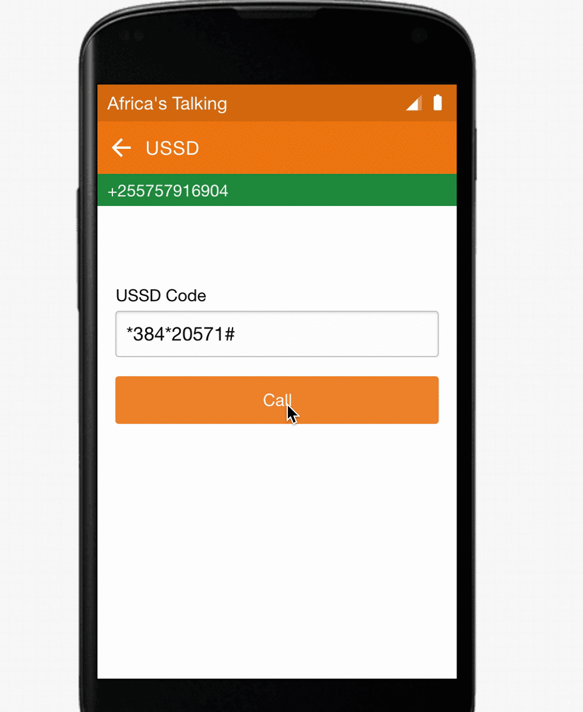

## Hack-A-Thing-2
### Ally Mahmoud
#### September 30, 2019

## Description:
Developed a simple USSD([Unstructured Supplementary Service Data](https://en.wikipedia.org/wiki/Unstructured_Supplementary_Service_Data)) using express server and Africa's talking api.

### Simple USSD Mobile Wallet
Followed this tutorial: https://github.com/AfricasTalkingLtd/africastalking-node.js

Built a simple Mobile Wallet USSD application that users can check their balance and top up. The express server is hosted in heroku at https://ussd-serverally.herokuapp.com/

* What I learned: Africas Talking, Express, Heroku
* What worked: The app works!
* What didn't work: Connecting different api can be tricky.

## Demo
* [Click here](https://simulator.africastalking.com:1517/simulator/ussd) to access  the simulator 
* Then enter any dummy number
* Then dial \*384*20571# in the simulator to access the app

